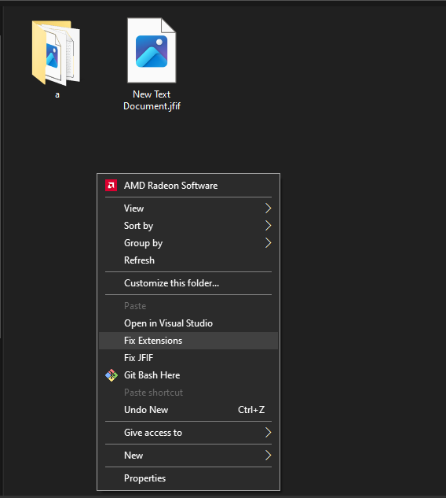

# A quick script to rename jfif files to jpg files

Read the blog post about why this exist <a href="https://peetseater.space/blag/2024-07-21-I-can-program-a-rename-to-a-function-faster-than-windows-can-do-it-with-ren">here.</a>

The code that is referenced on that blog post can be found in the `OriginalRenameCode.java` file.

## I decided I wanted to refactor and add a GUI

The script worked well enough ran from the CLI or command line, but it
takes extra effort to get the path of things, so it'd be nicer to right
click and be able to run the program from a context menu. And have the
program provide you some options and an input box to choose the extensions

To facilitate that, we need to package up the application into an exe 
for windows. Which we can do with jpackage like so:

```
mvn clean package

jpackage \
-t app-image \
-i target \
-n extbulkrename \
--main-jar extension-changer-1.0-SNAPSHOT.jar \
--main-class space.peetseater.rename.Main \
--verbose \
--description "Renames file extensions in bulk" \
--win-console
```

Next, update the PATH variable in windows to expose the extbulkrename
folder that was just created and then save the changes. 

Lastly, you can either edit the registry on your own to add in the commands:

For right clicking on a single file:
```
cmd /q /c "extbulkrename.exe --path %1"
```

For right clicking on the background of a directory:
```
cmd /q /c "extbulkrename.exe --path %V"
```

Both of these should be placed in your registry in the appropriate keys
with a `command` key underneath to work properly.

Or you can simply click on the setup-context-menu.reg file to let it do
it for you. Read the file with notepad if you're worried about what it's
doing on your system or if you want to just add it in manually yourself.

Once that's installed in your registry, you'll see this when you right click:




